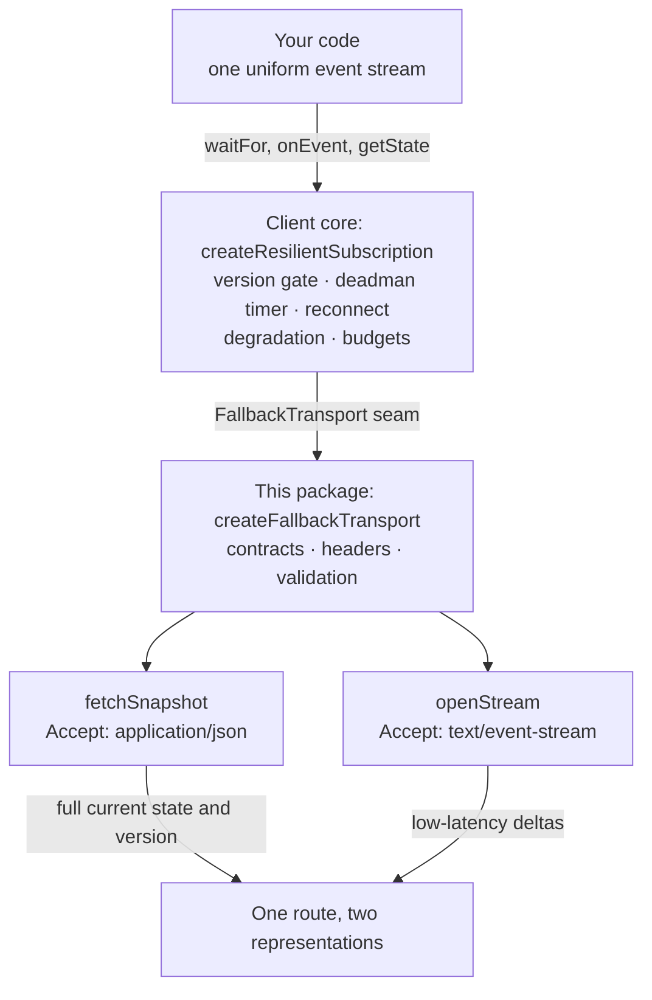
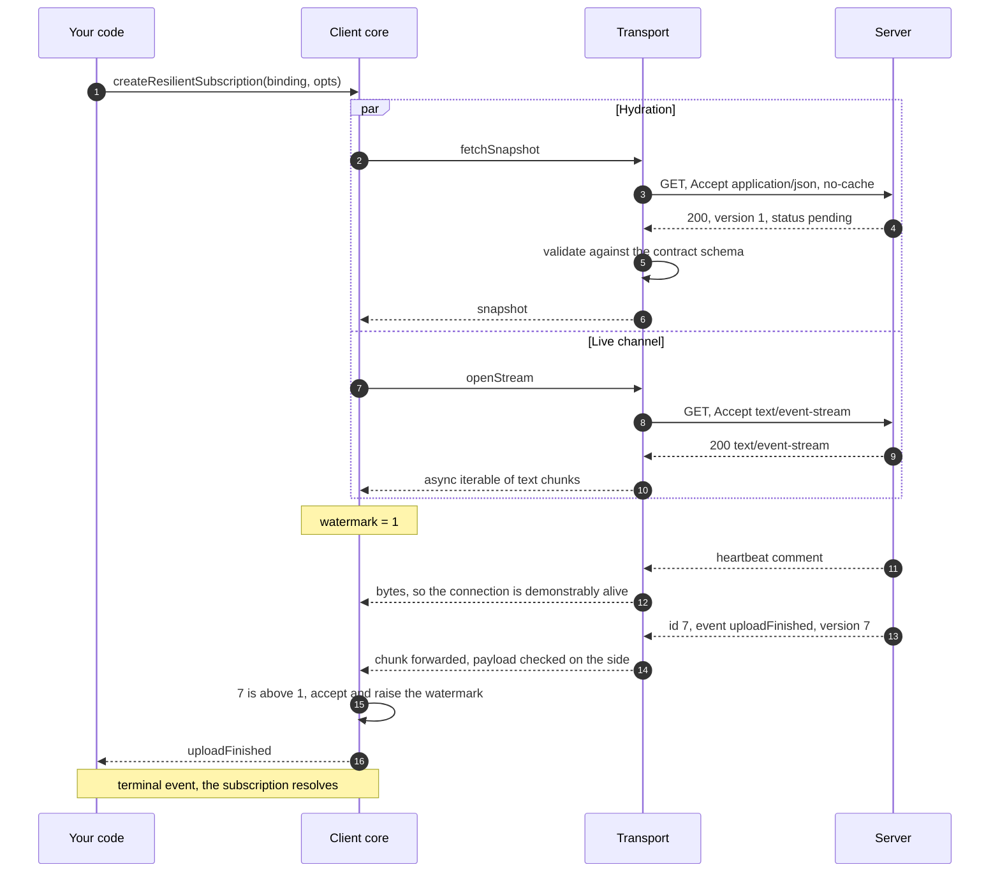
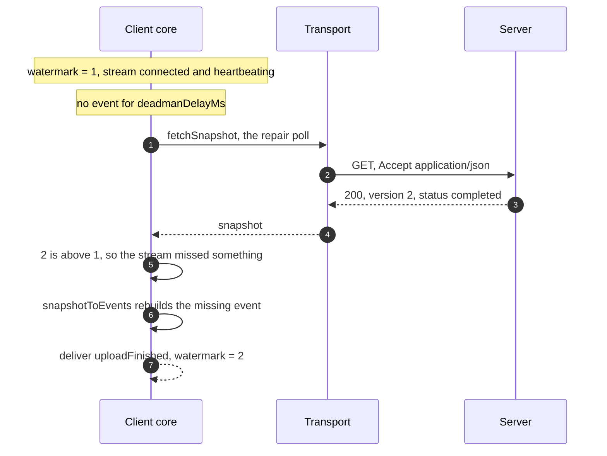
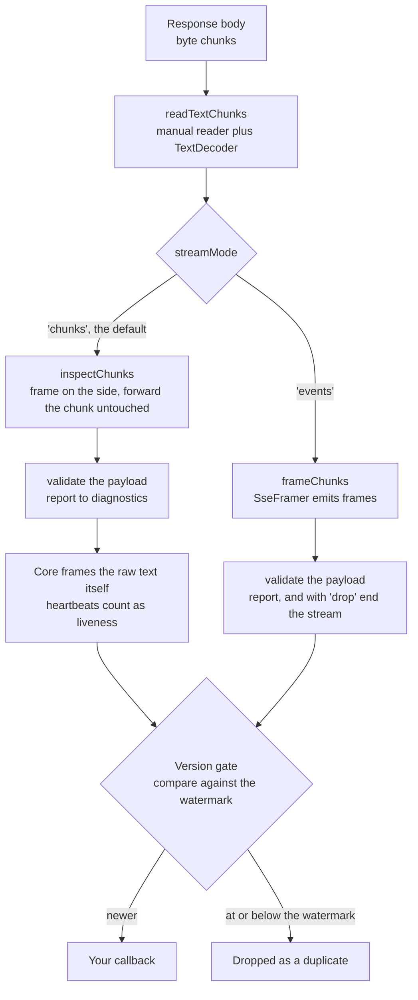
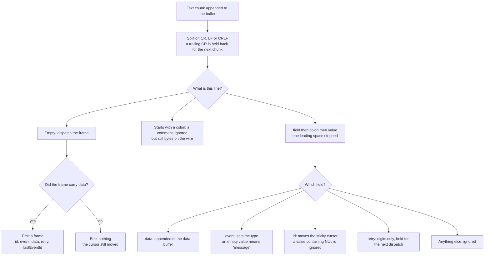
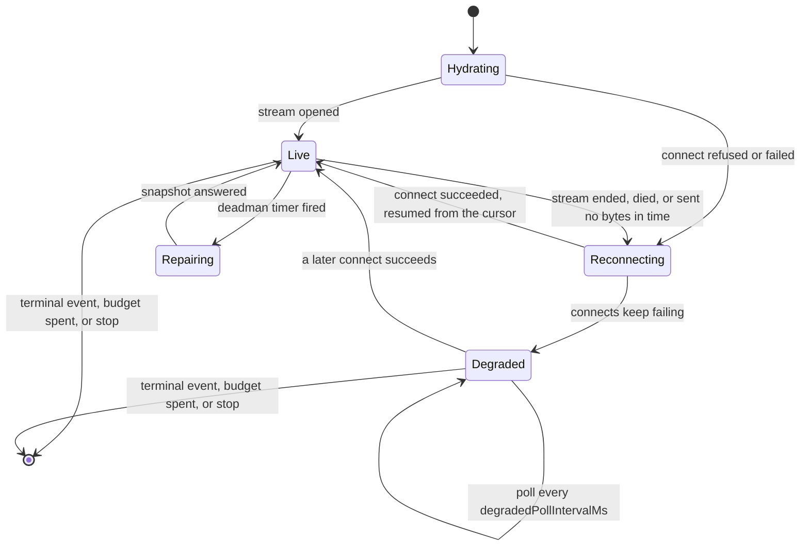
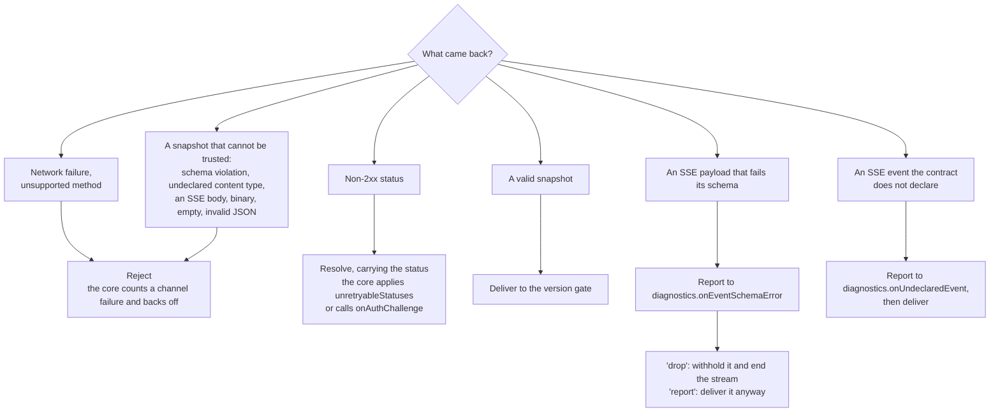
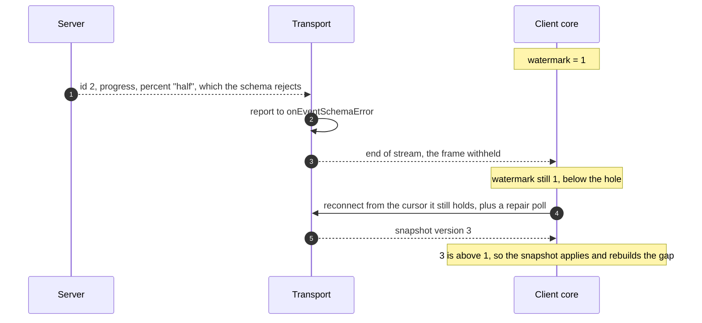

# How the SSE fallback works

A plain-language companion to the [Resilient live data](../README.md#resilient-live-data--sse-with-a-polling-fallback)
section of the README. That section is the reference: every option, every guarantee, every error.
This one is the mental model: what the moving parts are, and what happens to a single event on its
way from the server to your callback.

## The problem

A push channel can stop delivering without telling anyone. A connection dies with no error event,
a proxy kills a stream it thinks is idle, a room rebalance drops a message. Application code that
is waiting for "upload finished" then waits forever, and the only fix the user knows is a reload.

## The idea

**Poll for correctness, stream for latency.** A poll of the same route returns the full current
state, so it can always answer "what is true right now". The stream just makes the answer arrive
sooner. Both channels feed one version gate, so the subscription delivers each event once and your
code never learns which channel it came from.

## Who does what

| Layer | Lives in | Owns |
|---|---|---|
| Your code | your app | asks for events, waits for a terminal one |
| Contract | `@lokalise/api-contracts` | the shape of both branches: a JSON schema for the poll, `sseResponse` schemas for the stream |
| Binding | your app, one per contract | the one thing nothing can infer: how a snapshot relates to events (`snapshotToEvents`, `version.ofSnapshot`, `terminalEvents`) |
| Client core | `@opinionated-machine/sse-fallback` | timing and truth: hydration, deadman timer, version gate, reconnect, degradation, budgets |
| Transport | this package, `createFallbackTransport` | HTTP: `Accept` negotiation, fresh headers, `Last-Event-ID`, byte decoding, Zod validation |

The core owns no HTTP and this package owns no policy. That split is the whole design: the seam
between them is two functions, `fetchSnapshot` and `openStream`.

## The big picture

In words: your code talks to one subscription object. The subscription decides *when* to poll and
*when* to reconnect. This package decides *how* those two requests are made, and refuses anything
it cannot trust.

## One subscription, start to finish

In words: the subscription hydrates and connects at the same time, so it has state even if the
stream never opens. Every accepted event raises a watermark. A terminal event ends the whole
thing.

When the stream goes quiet, the deadman timer takes over:

That poll is the point of the whole library. The stream stayed up, kept sending heartbeats, and
simply never delivered the event. Polling caught it anyway.

## From bytes to an event your code sees

In words: the transport always reads the socket itself, because two things the core needs are
destroyed by framing that happens too early. Heartbeat comments are liveness evidence, and the
per-frame `id:` is what the version gate reads. In the default `'chunks'` mode the transport
therefore hands the core the exact bytes it received and validates on the side. In `'events'` mode
it hands over parsed frames, which is what makes withholding a bad one possible.

## The framer, line by line

`SseFramer` is the incremental parser behind both modes, and it is exported if you need it
directly. It follows the WHATWG event-stream rules:

Two details carry most of the weight. The reconnect cursor advances only when a frame is
dispatched, so a frame the connection cut off mid-way cannot make a reconnect skip past the event
it was carrying. And the per-frame `id:` is reported separately from the sticky cursor, because the
core's default version extractor reads the frame's own id: hand it the cursor instead and every
id-less frame looks like a repeat of the previous version.

## When things break

In words: the stream is allowed to fail. Losing it costs latency, not correctness, because the
polling backbone keeps the subscription answering. The thresholds and backoffs are core policy
(`sseRetryBackoff`, `deadmanDelayMs`, `degradedPollIntervalMs`, `staleConnectionTimeoutMs`,
`subscriptionBudget`). The transport contributes no timers of its own and imposes no deadlines,
so every wait stays bounded by the signal the core passes in.

`policy.mode: 'poll-only'` pins the machine to the polling side on purpose. That is how you adopt
the fallback before an SSE endpoint exists: same binding, same version gate, same state, and
turning the stream on later is a config change rather than a second migration.

## What each failure does

The rule the core relies on: a refusal is a result, and only something genuinely unusable is a
rejection.

In words: a 401 has to reach the core, because the core is the thing that can refresh a token and
retry. A snapshot that violates its schema must never reach the core, because a wrong version
poisons the watermark and silently drops every later event. A failed poll is recoverable; a
poisoned watermark is not.

## Why `'drop'` ends the stream

With `eventValidation: 'drop'`, withholding the bad frame is only half the job. Ending the
connection is the other half:

Had the transport withheld frame 2 and kept going, the next valid frame would have pushed the
watermark past the hole. The repair poll would then land at or below the watermark, where the
reconciler reads it as a stale duplicate and synthesizes nothing, so the withheld event would be
lost for good. The cost of ending the stream instead is one reconnect per rejected payload, which
is proportionate: a stream emitting bodies its own contract rejects is broken, and polling carries
the subscription meanwhile.

## Glossary

| Term | Meaning |
|---|---|
| Snapshot | The JSON body of a poll: full current state plus a version |
| Frame | One SSE event block, terminated by a blank line |
| Watermark | The highest version the subscription has accepted |
| Version gate | The check that compares an incoming version against the watermark, so each event is delivered once |
| Hydration | The first poll, which gives the subscription its initial state and its first watermark |
| Deadman timer | No *events* for `deadmanDelayMs`, so poll to find out what was missed |
| Stale-connection watchdog | No *bytes* for `staleConnectionTimeoutMs`, so the connection is presumed dead and gets reconnected |
| Cursor, `Last-Event-ID` | The id of the last dispatched frame, sent on reconnect so a server can replay from there |
| Degradation | The core giving up on the stream for a while and polling on an interval instead |
| Terminal event | An event that completes the subscription, as declared by the binding |
| Repair poll | A poll fired to close a gap the stream left |

## Picking the modes

| You want | Use |
|---|---|
| The default, which is the right answer almost always | `streamMode: 'chunks'` with `eventValidation: 'report'` |
| To adopt the fallback before an SSE endpoint exists | Any contract with a JSON branch, plus the core's `policy.mode: 'poll-only'` |
| A payload the contract rejects to never reach app code | `streamMode: 'events'` with `eventValidation: 'drop'`, accepting one reconnect per bad payload and an event-level liveness watchdog |
| No validation at all | `eventValidation: 'off'`, or no contract |
